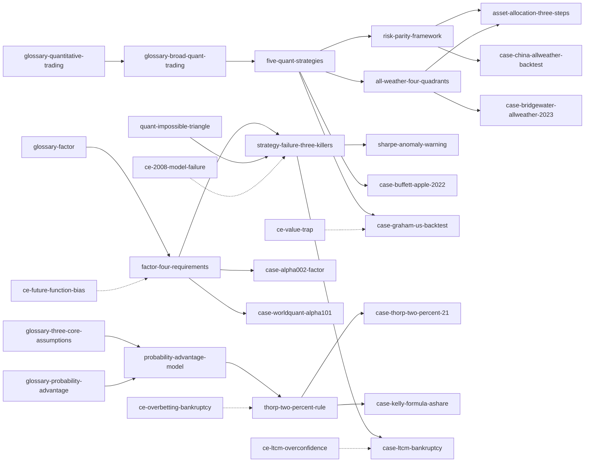

# 《GPT时代的量化交易》Skill Index

> 本书由 cangjie-skill 蒸馏，共产出 **70** 个 skills。
> 处理时间: 2026-08-12

## 关于这本书

- **书名**: 《GPT时代的量化交易：底层逻辑与技术实践》
- **作者**: 罗勇、卢洪波 等
- **出版年**: 2023
- **一句话主旨**: 在GPT降低编程门槛的时代，掌握量化交易的底层逻辑（而非工具）才是真正的竞争力
- **整书理解**: 见 [BOOK_OVERVIEW.md](./BOOK_OVERVIEW.md)
- **精华长文** (不读全书看这篇): [DIGEST.md](./DIGEST.md)
- **术语词典**: [GLOSSARY.md](./GLOSSARY.md)

---

## Skill 列表 (按主题分组)

### 量化哲学与策略选型 (8 个)

- [`five-quant-strategies`](./five-quant-strategies/SKILL.md) — 使用场景：量化策略选型/定位/分类。
- [`probability-advantage-model`](./probability-advantage-model/SKILL.md) — 使用场景：评估策略是否具备统计优势，避免单次胜负思维。
- [`risk-parity-framework`](./risk-parity-framework/SKILL.md) — 使用场景：构建风险均衡的资产配置组合。
- [`all-weather-four-quadrants`](./all-weather-four-quadrants/SKILL.md) — 使用场景：宏观环境不确定时构建跨周期资产配置。
- [`rsrs-timing-framework`](./rsrs-timing-framework/SKILL.md) — 使用场景：择时信号生成，判断市场阻力/支撑强度。
- [`rsrs-three-layer-optimization`](./rsrs-three-layer-optimization/SKILL.md) — 使用场景：RSRS指标迭代优化，提升择时信号质量。
- [`asset-allocation-three-steps`](./asset-allocation-three-steps/SKILL.md) — 使用场景：将全天候策略理念落地为可执行的投资组合。
- [`quant-ai-three-dimensions`](./quant-ai-three-dimensions/SKILL.md) — 使用场景：评估GPT/LLM在量化交易中的应用维度。

### 核心原则与规则 (11 个)

- [`thorp-two-percent-rule`](./thorp-two-percent-rule/SKILL.md) — 使用场景：单笔仓位上限决策，避免爆仓风险。
- [`factor-four-requirements`](./factor-four-requirements/SKILL.md) — 使用场景：验证因子是否具备实盘价值（四维检验）。
- [`quant-impossible-triangle`](./quant-impossible-triangle/SKILL.md) — 使用场景：策略设计时识别"不可能三角"约束。
- [`strategy-failure-three-killers`](./strategy-failure-three-killers/SKILL.md) — 使用场景：诊断策略失效原因（三大杀手）。
- [`sharpe-anomaly-warning`](./sharpe-anomaly-warning/SKILL.md) — 使用场景：监控夏普比率突变，识别策略失效。
- [`cta-three-values`](./cta-three-values/SKILL.md) — 使用场景：评估CTA策略的配置价值（危机alpha、低相关、绝对收益）。
- [`alternative-data-five-advantages`](./alternative-data-five-advantages/SKILL.md) — 使用场景：评估是否引入另类数据、论证数据护城河。
- [`event-driven-five-steps`](./event-driven-five-steps/SKILL.md) — 使用场景：事件驱动策略的系统化分析框架。
- [`convertible-bond-five-steps`](./convertible-bond-five-steps/SKILL.md) — 使用场景：可转债下修套利策略的完整流程。
- [`convertible-bond-trigger-conditions`](./convertible-bond-trigger-conditions/SKILL.md) — 使用场景：识别可转债下修触发条件。
- [`convertible-bond-entry-timing`](./convertible-bond-entry-timing/SKILL.md) — 使用场景：把握可转债下修介入时机。

### 实战案例 (23 个)

- [`case-honma-candlestick`](./case-honma-candlestick/SKILL.md) — 论证系统化记录价格数据是量化交易起点。
- [`case-thorp-boss-fund`](./case-thorp-boss-fund/SKILL.md) — 论证凯利公式在量化基金中的实战应用。
- [`case-simons-medallion`](./case-simons-medallion/SKILL.md) — 论证高频交易+多策略的阿尔法获取能力。
- [`case-buffett-apple-2022`](./case-buffett-apple-2022/SKILL.md) — 论证基本面反转信号触发买入。
- [`case-ashare-sector-momentum`](./case-ashare-sector-momentum/SKILL.md) — 论证行业基本面景气度可作为量化选股信号。
- [`case-china-allweather-backtest`](./case-china-allweather-backtest/SKILL.md) — 论证全天候策略在中国市场的可行性。
- [`case-dalio-1987-black-monday`](./case-dalio-1987-black-monday/SKILL.md) — 论证系统性宏观分析可预判市场崩溃。
- [`case-dalio-1982-failure`](./case-dalio-1982-failure/SKILL.md) — 论证过度自信和集中押注导致系统性失败。
- [`case-dalio-2008-crisis`](./case-dalio-2008-crisis/SKILL.md) — 论证债务周期分析可预判金融危机。
- [`case-dalio-2010-europe`](./case-dalio-2010-europe/SKILL.md) — 论证主权债务危机的系统性分析方法。
- [`case-bridgewater-allweather-2023`](./case-bridgewater-allweather-2023/SKILL.md) — 论证桥水全天候ETF组合在美国市场的实证表现。
- [`case-buffett-ashare-backtest`](./case-buffett-ashare-backtest/SKILL.md) — 论证巴菲特价值投资量化标准在A股的可行性。
- [`case-lynch-multifactor-backtest`](./case-lynch-multifactor-backtest/SKILL.md) — 论证多因子策略迭代优化流程。
- [`case-alpha002-factor`](./case-alpha002-factor/SKILL.md) — 论证价量动量因子构建与验证。
- [`case-ltcm-bankruptcy`](./case-ltcm-bankruptcy/SKILL.md) — 论证高杠杆风险和"低频黑天鹅不等于零"逻辑谬误。
- [`case-thorp-two-percent-21`](./case-thorp-two-percent-21/SKILL.md) — 论证2%仓位规则在21点赌博和量化投资中的应用。
- [`case-princeton-newport-fund`](./case-princeton-newport-fund/SKILL.md) — 论证索普的量化对冲基金实战业绩。
- [`case-kelly-formula-ashare`](./case-kelly-formula-ashare/SKILL.md) — 论证凯利公式在A股的具体仓位计算。
- [`case-graham-us-backtest`](./case-graham-us-backtest/SKILL.md) — 论证格雷厄姆选股法的量化验证。
- [`case-worldquant-alpha101`](./case-worldquant-alpha101/SKILL.md) — 论证WorldQuant阿尔法101因子的开源价值。
- [`case-lynch-magellan-fund`](./case-lynch-magellan-fund/SKILL.md) — 论证成长股选股的核心指标和主动基金经理的历史最佳业绩。
- [`case-fisher-growth-investing`](./case-fisher-growth-investing/SKILL.md) — 论证成长型价值投资理念起源和费雪对巴菲特的影响。
- [`case-revenue-factor-2022`](./case-revenue-factor-2022/SKILL.md) — 论证行业营收增长率因子的有效性。

### 失败模式与反例 (15 个)

- [`ce-ltcm-overconfidence`](./ce-ltcm-overconfidence/SKILL.md) — 警惕：顶尖团队的认知盲区（诺奖得主+高杠杆=破产）。
- [`ce-overbetting-bankruptcy`](./ce-overbetting-bankruptcy/SKILL.md) — 警惕：过度下注导致破产（索普2%法则的反面）。
- [`ce-dalio-1982-prediction-error`](./ce-dalio-1982-prediction-error/SKILL.md) — 警惕：过度自信和未对冲的集中押注。
- [`ce-dalio-1974-pork-belly`](./ce-dalio-1974-pork-belly/SKILL.md) — 警惕：猪腩期货跌停板的惨痛教训。
- [`ce-value-trap`](./ce-value-trap/SKILL.md) — 警惕：低估值陷阱（市盈率低≠好股票）。
- [`ce-buffett-textile-failure`](./ce-buffett-textile-failure/SKILL.md) — 警惕：夕阳行业中的价值投资失败。
- [`ce-qualitative-only-risk`](./ce-qualitative-only-risk/SKILL.md) — 警惕：纯定性分析的风险（无数据支撑）。
- [`ce-2008-model-failure`](./ce-2008-model-failure/SKILL.md) — 警惕：2008年CDO模型失效（过度依赖单一模型）。
- [`ce-kelly-formula-overoptimism`](./ce-kelly-formula-overoptimism/SKILL.md) — 警惕：凯利公式过度乐观估计（忽略黑天鹅）。
- [`ce-hft-compliance-risk`](./ce-hft-compliance-risk/SKILL.md) — 警惕：高频交易的合规风险。
- [`ce-momentum-chaotic-market`](./ce-momentum-chaotic-market/SKILL.md) — 警惕：动量因子在无序轮动市场中的失效。
- [`ce-event-driven-decay`](./ce-event-driven-decay/SKILL.md) — 警惕：事件驱动策略失效周期缩短（"一日游"现象）。
- [`ce-alpha002-hs300-failure`](./ce-alpha002-hs300-failure/SKILL.md) — 警惕：阿尔法002因子在沪深300中表现不佳。
- [`ce-limit-up-data-distortion`](./ce-limit-up-data-distortion/SKILL.md) — 警惕：涨跌停板扭曲价量数据导致因子失效。
- [`ce-future-function-bias`](./ce-future-function-bias/SKILL.md) — 警惕：未来函数导致回测有效实盘无效。

### 关键术语 (13 个)

- [`glossary-quantitative-trading`](./glossary-quantitative-trading/SKILL.md) — 量化交易（广义定义）。
- [`glossary-broad-quant-trading`](./glossary-broad-quant-trading/SKILL.md) — 广义量化交易（包含基本面、资产配置等）。
- [`glossary-three-core-assumptions`](./glossary-three-core-assumptions/SKILL.md) — 三重核心假设（上帝视角/局部最优/市场非理性）。
- [`glossary-fundamental-quant-strategy`](./glossary-fundamental-quant-strategy/SKILL.md) — 基本面量化交易策略。
- [`glossary-asset-allocation-strategy`](./glossary-asset-allocation-strategy/SKILL.md) — 资产配置量化交易策略。
- [`glossary-alternative-quant-strategy`](./glossary-alternative-quant-strategy/SKILL.md) — 另类量化交易策略。
- [`glossary-everything-quantifiable`](./glossary-everything-quantifiable/SKILL.md) — 万物皆可量化（恩格斯命题）。
- [`glossary-factor`](./glossary-factor/SKILL.md) — 因子（底层逻辑的量化表达）。
- [`glossary-probability-advantage`](./glossary-probability-advantage/SKILL.md) — 概率优势（量化交易的核心机制）。
- [`glossary-meta-knowledge-learning`](./glossary-meta-knowledge-learning/SKILL.md) — 元知识学习（用AI选择策略）。
- [`glossary-game-equilibrium`](./glossary-game-equilibrium/SKILL.md) — 博弈平衡点（五类策略的最终演化状态）。
- [`glossary-worldquant-alpha101`](./glossary-worldquant-alpha101/SKILL.md) — WorldQuant阿尔法101因子（2015年开源）。
- [`glossary-quant-first-year`](./glossary-quant-first-year/SKILL.md) — 量化元年（美国2011/中国2016）。

---

## 引用图



图例:
- `-->`  depends-on（前置依赖）
- `-.->` contrasts-with（对比/警示）
- `===>` composes-with（组合使用）

---

## 推荐学习顺序

(从依赖图的叶子节点开始，向上)

1. **术语层** — 先掌握13个关键术语（`glossary-*`），建立基本概念
2. **概率优势思维模型** — 理解量化交易的哲学基础（上帝视角/局部最优/市场非理性）
3. **五大量化策略选择框架** — 掌握策略分类体系（基本面/资产配置/阿尔法/贝塔/另类）
4. **核心原则** — 学习11条核心规则（2%法则、因子四维、不可能三角、三大杀手等）
5. **框架层** — 深入8个决策框架（风险平价、全天候、RSRS择时等）
6. **实战案例** — 通过23个案例验证理论（本间宗久→索普→西蒙斯→巴菲特→达利欧）
7. **失败反例** — 通过15个反例警惕常见陷阱（LTCM破产、价值陷阱、未来函数等）

---

## 安装使用

本目录是构建产物，宿主不会从这里加载 skill。要让 agent 真正调用，把 skill 目录复制到宿主的 skills 目录:

```bash
# 用户级 (所有项目可用)
cp -r five-quant-strategies ~/.claude/skills/

# 或项目级
cp -r five-quant-strategies <project>/.claude/skills/    # Claude Code
cp -r five-quant-strategies <project>/.cursor/skills/    # Cursor
```

---

## 接入 darwin-skill

所有 skill 均带有 `test-prompts.json` (darwin-skill 兼容格式)，可直接接入自动进化:

```
darwin evolve books/gpt-era-quant-trading/
```

---

## 审计轨迹

- 候选单元池: [candidates/](./candidates/)
- 被淘汰的候选 (含原因): [rejected/](./rejected/)
- BOOK_OVERVIEW: [BOOK_OVERVIEW.md](./BOOK_OVERVIEW.md)
