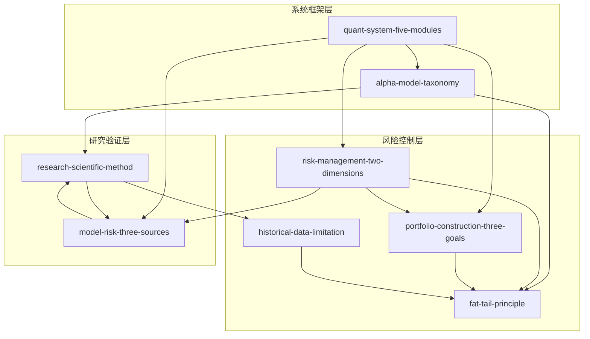

# 量化交易方法论技能索引

## 技能总览

共8个技能，分为三个层次：

### 系统框架层
- **[quant-system-five-modules](quant-system-five-modules/SKILL.md)**：量化交易系统五模块分解
- **[alpha-model-taxonomy](alpha-model-taxonomy/SKILL.md)**：阿尔法模型的二元分类

### 风险控制层
- **[risk-management-two-dimensions](risk-management-two-dimensions/SKILL.md)**：风险管理的二维控制框架
- **[portfolio-construction-three-goals](portfolio-construction-three-goals/SKILL.md)**：投资组合构建的三目标平衡
- **[fat-tail-principle](fat-tail-principle/SKILL.md)**：市场数据的厚尾特征原则
- **[historical-data-limitation](historical-data-limitation/SKILL.md)**：依赖历史数据的根本局限

### 研究验证层
- **[research-scientific-method](research-scientific-method/SKILL.md)**：策略研究的科学方法流程
- **[model-risk-three-sources](model-risk-three-sources/SKILL.md)**：模型风险的三种来源分类

## 技能关系图

## 依赖关系详解

### 核心技能：quant-system-five-modules
- **依赖**：alpha-model-taxonomy、risk-management-two-dimensions、portfolio-construction-three-goals、model-risk-three-sources
- **被依赖**：无（最顶层框架）
- **用途**：理解量化交易系统的整体架构

### 阿尔法模型：alpha-model-taxonomy
- **依赖**：quant-system-five-modules
- **被依赖**：quant-system-five-modules、research-scientific-method
- **用途**：分类和设计阿尔法模型

### 风险控制：risk-management-two-dimensions
- **依赖**：quant-system-five-modules、fat-tail-principle、model-risk-three-sources
- **被依赖**：quant-system-five-modules、portfolio-construction-three-goals
- **用途**：控制风险的两个维度（规模和种类）

### 组合构建：portfolio-construction-three-goals
- **依赖**：quant-system-five-modules、risk-management-two-dimensions、alpha-model-taxonomy、fat-tail-principle
- **被依赖**：quant-system-five-modules
- **用途**：在收益、风险、成本三目标间平衡

### 厚尾风险：fat-tail-principle
- **依赖**：risk-management-two-dimensions、model-risk-three-sources
- **被依赖**：risk-management-two-dimensions、portfolio-construction-three-goals、alpha-model-taxonomy、research-scientific-method、historical-data-limitation
- **用途**：提醒正态分布假设的局限性

### 历史数据局限：historical-data-limitation
- **依赖**：fat-tail-principle、model-risk-three-sources
- **被依赖**：research-scientific-method
- **用途**：提醒历史数据依赖的根本局限

### 科学方法：research-scientific-method
- **依赖**：alpha-model-taxonomy、historical-data-limitation、fat-tail-principle、model-risk-three-sources
- **被依赖**：alpha-model-taxonomy
- **用途**：系统性地研发和验证策略

### 模型风险：model-risk-three-sources
- **依赖**：fat-tail-principle、historical-data-limitation
- **被依赖**：quant-system-five-modules、risk-management-two-dimensions、research-scientific-method
- **用途**：识别和评估模型风险的三种来源

## 使用场景

### 初学者学习路径
1. **quant-system-five-modules** → 理解整体架构
2. **alpha-model-taxonomy** → 理解阿尔法模型分类
3. **risk-management-two-dimensions** → 理解风险控制
4. **portfolio-construction-three-goals** → 理解组合构建

### 策略研发流程
1. **research-scientific-method** → 系统性研发流程
2. **alpha-model-taxonomy** → 选择和设计阿尔法模型
3. **model-risk-three-sources** → 评估模型风险
4. **fat-tail-principle** → 考虑厚尾风险
5. **historical-data-limitation** → 认识历史数据局限

### 风险评估流程
1. **model-risk-three-sources** → 识别模型风险来源
2. **fat-tail-principle** → 评估厚尾风险
3. **risk-management-two-dimensions** → 设计风险控制
4. **portfolio-construction-three-goals** → 优化组合构建

### 策略诊断流程
1. **model-risk-three-sources** → 诊断模型风险
2. **historical-data-limitation** → 检查历史数据依赖
3. **fat-tail-principle** → 评估厚尾风险影响
4. **risk-management-two-dimensions** → 调整风险控制

## 技能统计

- **总技能数**：8
- **框架类**：5个（quant-system-five-modules、alpha-model-taxonomy、risk-management-two-dimensions、portfolio-construction-three-goals、research-scientific-method）
- **原则类**：2个（fat-tail-principle、historical-data-limitation）
- **反例类**：1个（model-risk-three-sources）

## 验证状态

所有8个技能均通过三重验证：
- ✅ V1 跨域验证：在多个章节反复出现
- ✅ V2 预测力测试：能推导书外问题
- ✅ V3 独特性检验：非泛泛常识

## 下一步

1. 阶段4：压力测试（每个技能设计5-10条测试提示词）
2. 阶段5：交付（生成DIGEST.md和安装到skills目录）
