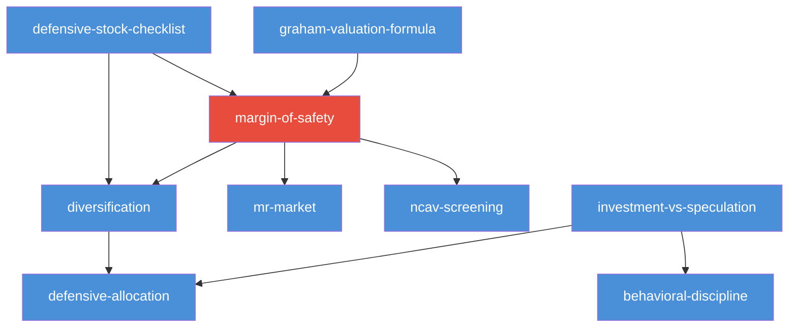

# INDEX — 《聪明的投资者》Skill 总览

> 本索引是 cangjie-skill 流水线阶段 3 产出。9 个 skill 覆盖了格雷厄姆价值投资的核心方法论。

## Skill 引用关系图

**箭头含义**: `A → B` means "A depends on B" (A 的执行需要 B 的输出)

---

## Skill 清单

| # | 名称 | slug | 章节 | 类型 | 前置依赖 |
|---|------|------|------|------|---------|
| 1 | 投资与投机的分界 | investment-vs-speculation | Ch.1 | 分类框架 | 无 |
| 2 | 防御型资产配置 | defensive-allocation | Ch.4 | 组合策略 | investment-vs-speculation |
| 3 | 格雷厄姆估值公式 | graham-valuation-formula | Ch.11 | 量化工具 | 无 |
| 4 | 防御型选股七标准 | defensive-stock-checklist | Ch.14 | 筛选清单 | 无 |
| 5 | 安全边际框架 | margin-of-safety | Ch.20 | 核心理念 | graham-valuation-formula |
| 6 | 市场先生心理框架 | mr-market | Ch.8 | 心理模型 | graham-valuation-formula, margin-of-safety |
| 7 | 净流动资产价值筛选 | ncav-screening | Ch.15 | 极端价值策略 | margin-of-safety |
| 8 | 分散化原则 | diversification | Ch.14,20 | 风险管理 | margin-of-safety |
| 9 | 行为纪律框架 | behavioral-discipline | Ch.1,8,20 | 情绪管理 | mr-market, margin-of-safety |

---

## 引用关系详细说明

### depends-on (前置依赖)

| Skill | 依赖 | 说明 |
|-------|------|------|
| defensive-allocation | investment-vs-speculation | 先判断"什么能投资"，再配置资产 |
| margin-of-safety | graham-valuation-formula | 先估值，再计算安全边际 |
| mr-market | graham-valuation-formula, margin-of-safety | 需要估值锚和边际概念来利用市场报价 |
| ncav-screening | margin-of-safety | NCAV 是安全边际的极端体现 |
| diversification | margin-of-safety | 安全边际保护单笔投资，分散化保护组合 |
| behavioral-discipline | mr-market, margin-of-safety | 需要认知框架和市场理解才能执行纪律 |

### contrasts-with (对比关系)

| Skill A | Skill B | 区别 |
|---------|---------|------|
| investment-vs-speculation | margin-of-safety | 分类框架 vs 估值框架 |
| investment-vs-speculation | behavioral-discipline | 做什么 vs 怎么做 |
| defensive-allocation | diversification | 大类资产配比 vs 个股分散 |
| graham-valuation-formula | margin-of-safety | 计算价值 vs 使用价值决策 |
| graham-valuation-formula | defensive-stock-checklist | 定量估值 vs 定性筛选 |
| defensive-stock-checklist | margin-of-safety | 能不能买 vs 该不该现在买 |
| market | behavioral-discipline | 认知框架 vs 行动规则 |
| ncav-screening | defensive-stock-checklist | 极端困境股 vs 正常稳健股 |
| diversification | defensive-allocation | 个股分散 vs 大类资产配置 |

### composes-with (组合关系)

| Skill A | Skill B | 组合效果 |
|---------|---------|----------|
| investment-vs-speculation + defensive-allocation | → 防御型投资完整路线 |
| investment-vs-speculation + behavioral-discipline | → 投资纪律执行 |
| graham-valuation-formula + margin-of-safety | → 完整估值-决策链 |
| margin-of-safety + defensive-stock-checklist | → 筛选+安全边际 |
| mr-market + margin-of-safety | → 利用市场波动+价格保护 |
| defensive-allocation + diversification | → 完整组合构建 |
| defensive-allocation + behavioral-discipline | → 纪律化配置执行 |
| margin-of-safety + diversification | → 双重保护 |

---

## 引用图的读法

1. **从底部读**: 最底层是无依赖的 skill (investment-vs-speculation, graham-valuation-formula, defensive-stock-checklist)
2. **向上延伸**: 每个 skill 依赖底层 skill 的产出
3. **核心枢纽**: margin-of-safety 是连接最多 skill 的枢纽 (4 个 skill 依赖它)
4. **推荐学习顺序**: 
   - 新手: investment-vs-speculation → defensive-allocation → diversification
   - 进阶: graham-valuation-formula → margin-of-safety → defensive-stock-checklist
   - 高级: mr-market → behavioral-discipline → ncav-screening