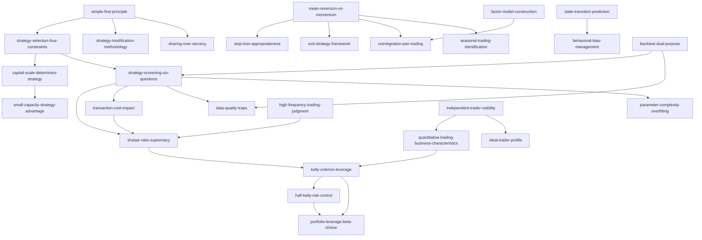

# INDEX.md — 量化交易 Skill 总览

> 《量化交易：如何建立自己的算法交易事业》Ernest Chan
> 共 27 个 skills，按逻辑依赖关系组织

---

## 📊 Skill 依赖图

---

## 🎯 按使用场景分类

### 场景1：我是新手，想开始量化交易

**推荐路径**：
1. [ideal-trader-profile](#ideal-trader-profile) — 评估你是否适合量化交易
2. [independent-trader-viability](#independent-trader-viability) — 独立交易员的可行性
3. [quantitative-trading-business-characteristics](#quantitative-trading-business-characteristics) — 量化交易业务特性
4. [simple-first-principle](#simple-first-principle) — 简单至上原则
5. [strategy-selection-four-constraints](#strategy-selection-four-constraints) — 策略选择四要素
6. [capital-scale-determines-strategy](#capital-scale-determines-strategy) — 资本规模决定策略类型

### 场景2：我有策略想法，如何评估？

**推荐路径**：
1. [strategy-screening-six-questions](#strategy-screening-six-questions) — 策略快速筛选六问法
2. [sharpe-ratio-supremacy](#sharpe-ratio-supremacy) — 夏普比率优于收益率
3. [transaction-cost-impact](#transaction-cost-impact) — 交易成本影响评估
4. [data-quality-traps](#data-quality-traps) — 数据质量陷阱识别
5. [parameter-complexity-overfitting](#parameter-complexity-overfitting) — 参数复杂度与过拟合
6. [backtest-dual-purpose](#backtest-dual-purpose) — 回测的双重目的

### 场景3：策略回测成功，如何实盘？

**推荐路径**：
1. [kelly-criterion-leverage](#kelly-criterion-leverage) — 凯利公式最优杠杆
2. [half-kelly-risk-control](#half-kelly-risk-control) — 半凯利风险控制
3. [portfolio-leverage-beta-choice](#portfolio-leverage-beta-choice) — 组合杠杆与贝塔选择
4. [strategy-modification-methodology](#strategy-modification-methodology) — 策略变形方法论
5. [sharing-over-secrecy](#sharing-over-secrecy) — 分享优于保密

### 场景4：如何选择策略类型？

**推荐路径**：
1. [mean-reversion-vs-momentum](#mean-reversion-vs-momentum) — 均值回归 vs 动量策略
2. [stop-loss-appropriateness](#stop-loss-appropriateness) — 止损策略适用性
3. [exit-strategy-framework](#exit-strategy-framework) — 清仓策略选择
4. [cointegration-pair-trading](#cointegration-pair-trading) — 协整与配对交易
5. [factor-model-construction](#factor-model-construction) — 因子模型构建
6. [seasonal-trading-identification](#seasonal-trading-identification) — 季节性交易识别
7. [high-frequency-trading-judgment](#high-frequency-trading-judgment) — 高频交易判断

### 场景5：策略失效了，怎么办？

**推荐路径**：
1. [state-transition-prediction](#state-transition-prediction) — 状态转换预测
2. [behavioral-bias-management](#behavioral-bias-management) — 行为偏差管理
3. [strategy-modification-methodology](#strategy-modification-methodology) — 策略变形方法论
4. [small-capacity-strategy-advantage](#small-capacity-strategy-advantage) — 小容量策略优势

---

## 📚 Skill 详细列表

### 基础原则 (4)

| Skill | 一句话描述 | 核心依赖 |
|-------|-----------|---------|
| [simple-first-principle](skills/simple-first-principle/) | 简单策略优于复杂策略 | 无 |
| [strategy-selection-four-constraints](skills/strategy-selection-four-constraints/) | 策略选择受四要素约束 | simple-first-principle |
| [strategy-modification-methodology](skills/strategy-modification-methodology/) | 对基础策略进行变形 | simple-first-principle |
| [sharing-over-secrecy](skills/sharing-over-secrecy/) | 分享策略比保密更有益 | simple-first-principle |

### 策略评估 (6)

| Skill | 一句话描述 | 核心依赖 |
|-------|-----------|---------|
| [strategy-screening-six-questions](skills/strategy-screening-six-questions/) | 快速筛选策略的六问法 | strategy-selection-four-constraints |
| [sharpe-ratio-supremacy](skills/sharpe-ratio-supremacy/) | 夏普比率优于收益率 | strategy-screening-six-questions |
| [transaction-cost-impact](skills/transaction-cost-impact/) | 交易成本可以消灭策略盈利 | sharpe-ratio-supremacy |
| [data-quality-traps](skills/data-quality-traps/) | 识别数据质量陷阱 | strategy-screening-six-questions |
| [parameter-complexity-overfitting](skills/parameter-complexity-overfitting/) | 参数越多越容易过拟合 | strategy-screening-six-questions |
| [backtest-dual-purpose](skills/backtest-dual-purpose/) | 回测的双重目的 | strategy-screening-six-questions |

### 风险管理 (3)

| Skill | 一句话描述 | 核心依赖 |
|-------|-----------|---------|
| [kelly-criterion-leverage](skills/kelly-criterion-leverage/) | 凯利公式计算最优杠杆 | sharpe-ratio-supremacy |
| [half-kelly-risk-control](skills/half-kelly-risk-control/) | 半凯利控制风险 | kelly-criterion-leverage |
| [portfolio-leverage-beta-choice](skills/portfolio-leverage-beta-choice/) | 低贝塔+高杠杆 vs 高贝塔+低杠杆 | kelly-criterion-leverage, sharpe-ratio-supremacy |

### 策略类型 (7)

| Skill | 一句话描述 | 核心依赖 |
|-------|-----------|---------|
| [mean-reversion-vs-momentum](skills/mean-reversion-vs-momentum/) | 均值回归 vs 动量策略选择 | 无 |
| [stop-loss-appropriateness](skills/stop-loss-appropriateness/) | 止损策略适用性判断 | mean-reversion-vs-momentum |
| [exit-strategy-framework](skills/exit-strategy-framework/) | 清仓策略选择框架 | mean-reversion-vs-momentum |
| [cointegration-pair-trading](skills/cointegration-pair-trading/) | 协整检验与配对交易构建 | mean-reversion-vs-momentum |
| [factor-model-construction](skills/factor-model-construction/) | 因子模型构建与应用 | cointegration-pair-trading |
| [seasonal-trading-identification](skills/seasonal-trading-identification/) | 季节性交易策略识别 | mean-reversion-vs-momentum |
| [high-frequency-trading-judgment](skills/high-frequency-trading-judgment/) | 高频交易适用性判断 | sharpe-ratio-supremacy |

### 事业构建 (4)

| Skill | 一句话描述 | 核心依赖 |
|-------|-----------|---------|
| [ideal-trader-profile](skills/ideal-trader-profile/) | 理想交易员画像 | 无 |
| [independent-trader-viability](skills/independent-trader-viability/) | 独立交易员可行性论证 | ideal-trader-profile |
| [quantitative-trading-business-characteristics](skills/quantitative-trading-business-characteristics/) | 量化交易业务特性 | independent-trader-viability |
| [capital-scale-determines-strategy](skills/capital-scale-determines-strategy/) | 资本规模决定策略类型 | strategy-selection-four-constraints |
| [small-capacity-strategy-advantage](skills/small-capacity-strategy-advantage/) | 小容量策略的结构性优势 | capital-scale-determines-strategy |

### 高级主题 (3)

| Skill | 一句话描述 | 核心依赖 |
|-------|-----------|---------|
| [state-transition-prediction](skills/state-transition-prediction/) | 预测策略失效的状态转换 | 无 |
| [behavioral-bias-management](skills/behavioral-bias-management/) | 识别与克服行为偏差 | state-transition-prediction |

---

## 🔗 Skill 间关系矩阵

### depends-on (必须先理解)

| Skill | depends-on |
|-------|-----------|
| strategy-selection-four-constraints | simple-first-principle |
| strategy-screening-six-questions | strategy-selection-four-constraints |
| sharpe-ratio-supremacy | strategy-screening-six-questions |
| transaction-cost-impact | sharpe-ratio-supremacy |
| kelly-criterion-leverage | sharpe-ratio-supremacy |
| half-kelly-risk-control | kelly-criterion-leverage |
| portfolio-leverage-beta-choice | kelly-criterion-leverage, sharpe-ratio-supremacy |
| stop-loss-appropriateness | mean-reversion-vs-momentum |
| exit-strategy-framework | mean-reversion-vs-momentum |
| cointegration-pair-trading | mean-reversion-vs-momentum |
| factor-model-construction | cointegration-pair-trading |
| seasonal-trading-identification | mean-reversion-vs-momentum |
| behavioral-bias-management | state-transition-prediction |
| small-capacity-strategy-advantage | capital-scale-determines-strategy |
| independent-trader-viability | ideal-trader-profile |
| quantitative-trading-business-characteristics | independent-trader-viability |

### composes-with (可以组合使用)

| Skill | composes-with |
|-------|--------------|
| kelly-criterion-leverage | half-kelly-risk-control |
| half-kelly-risk-control | portfolio-leverage-beta-choice |
| stop-loss-appropriateness | half-kelly-risk-control |
| strategy-modification-methodology | sharing-over-secrecy |
| cointegration-pair-trading | factor-model-construction |

### contrasts-with (对比理解)

| Skill | contrasts-with |
|-------|---------------|
| mean-reversion-vs-momentum | 两种策略类型的对比 |
| stop-loss-appropriateness | exit-strategy-framework |
| portfolio-leverage-beta-choice | high-frequency-trading-judgment |
| sharpe-ratio-supremacy | strategy-screening-six-questions |

---

## 📖 推荐阅读顺序

### 路径A：从零开始的完整学习路径

1. **入门准备** (1-2天)
   - ideal-trader-profile
   - independent-trader-viability
   - quantitative-trading-business-characteristics
   - simple-first-principle

2. **策略选择** (3-5天)
   - strategy-selection-four-constraints
   - capital-scale-determines-strategy
   - small-capacity-strategy-advantage
   - strategy-screening-six-questions

3. **策略评估** (5-7天)
   - sharpe-ratio-supremacy
   - transaction-cost-impact
   - data-quality-traps
   - parameter-complexity-overfitting
   - backtest-dual-purpose

4. **风险管理** (3-5天)
   - kelly-criterion-leverage
   - half-kelly-risk-control
   - portfolio-leverage-beta-choice

5. **策略类型** (7-10天)
   - mean-reversion-vs-momentum
   - stop-loss-appropriateness
   - exit-strategy-framework
   - cointegration-pair-trading
   - factor-model-construction
   - seasonal-trading-identification
   - high-frequency-trading-judgment

6. **高级主题** (3-5天)
   - state-transition-prediction
   - behavioral-bias-management
   - strategy-modification-methodology
   - sharing-over-secrecy

**总计**：22-34天完成全部学习

### 路径B：快速实战路径（已有交易经验）

1. **快速评估** (1天)
   - simple-first-principle
   - strategy-screening-six-questions
   - sharpe-ratio-supremacy

2. **风险管理** (2天)
   - kelly-criterion-leverage
   - half-kelly-risk-control

3. **选择策略类型** (2天)
   - mean-reversion-vs-momentum
   - cointegration-pair-trading

4. **实盘准备** (1天)
   - strategy-modification-methodology
   - sharing-over-secrecy

**总计**：6天快速上手

### 路径C：深度学习路径（学术研究）

按依赖图的拓扑排序，从基础原则到高级主题，重点关注：
- 数学证明（sharpe-ratio-supremacy, kelly-criterion-leverage）
- 统计方法（cointegration-pair-trading, factor-model-construction）
- 市场微观结构（mean-reversion-vs-momentum, state-transition-prediction）

**总计**：30-45天深度学习

---

## 🎓 Skill 难度分级

### ⭐ 入门级（无需数学背景）

- simple-first-principle
- ideal-trader-profile
- independent-trader-viability
- sharing-over-secrecy
- strategy-modification-methodology

### ⭐⭐ 进阶级（需要基础统计知识）

- strategy-selection-four-constraints
- capital-scale-determines-strategy
- strategy-screening-six-questions
- sharpe-ratio-supremacy
- transaction-cost-impact
- data-quality-traps
- mean-reversion-vs-momentum
- stop-loss-appropriateness
- exit-strategy-framework
- behavioral-bias-management

### ⭐⭐⭐ 高级（需要数学推导能力）

- kelly-criterion-leverage
- half-kelly-risk-control
- portfolio-leverage-beta-choice
- parameter-complexity-overfitting
- cointegration-pair-trading
- factor-model-construction
- state-transition-prediction
- high-frequency-trading-judgment

---

## 🔧 快速查询索引

### 我想...

**评估自己是否适合量化交易**
→ ideal-trader-profile, independent-trader-viability

**选择第一个策略**
→ strategy-selection-four-constraints, capital-scale-determines-strategy, strategy-screening-six-questions

**判断策略好坏**
→ sharpe-ratio-supremacy, transaction-cost-impact, data-quality-traps

**确定用多少杠杆**
→ kelly-criterion-leverage, half-kelly-risk-control, portfolio-leverage-beta-choice

**选择策略类型**
→ mean-reversion-vs-momentum, cointegration-pair-trading, seasonal-trading-identification

**改进现有策略**
→ strategy-modification-methodology, parameter-complexity-overfitting

**处理策略失效**
→ state-transition-prediction, behavioral-bias-management

**理解市场结构**
→ mean-reversion-vs-momentum, state-transition-prediction, factor-model-construction

**构建配对交易**
→ cointegration-pair-trading, factor-model-construction

**做高频交易**
→ high-frequency-trading-judgment, sharpe-ratio-supremacy

---

## 📝 更新日志

- 2026-08-13: 初始版本，27个skills完成构造
- 2026-08-13: 完成Stage 3 Zettelkasten链接
