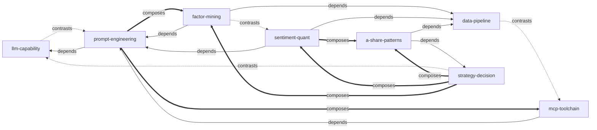

# 《AI 量化交易》Skill Index

> 本书由 cangjie-skill 蒸馏，共产出 **8** 个 skills。
> 处理时间：2026-08-16

## 关于这本书

- **作者**：罗勇、卢洪波、王光伟、罗天奇
- **出版年**：2025（电子工业出版社）
- **一句话主旨**：用生成式 AI（大模型/提示词工程/智能体）高效构建 15 类可落地的量化交易策略，打通从理论到实盘收益的"最后一公里"
- **整书理解**：见 [BOOK_OVERVIEW.md](./BOOK_OVERVIEW.md)
- **精华长文**（不读全书看这篇）：[DIGEST.md](./DIGEST.md)
- **术语词典**：[GLOSSARY.md](./GLOSSARY.md)

---

## Skill 列表（按主题分组）

### 🧠 AI 工具层 — 怎么选、怎么问、怎么连

- [`llm-capability`](./llm-capability/SKILL.md) — 大模型能力分级（九大段位）与模型选型
- [`prompt-engineering`](./prompt-engineering/SKILL.md) — 量化交易提示词三大框架（CRISPE / BROKE / ICIO）
- [`mcp-toolchain`](./mcp-toolchain/SKILL.md) — MCP/A2A 协议搭建智能体量化工具链

### 📊 数据与因子层 — 数据从哪来、因子怎么挖

- [`data-pipeline`](./data-pipeline/SKILL.md) — 数据获取/清洗/特征构造流水线（AKShare / Tushare / Wind）
- [`factor-mining`](./factor-mining/SKILL.md) — AI 辅助因子挖掘全流程（LV2 / ML 特征 / NLP 提取）
- [`sentiment-quant`](./sentiment-quant/SKILL.md) — 市场情绪量化（NLP 情感分析 / 舆情监控 / 事件驱动）

### 🎯 策略决策层 — 选什么策略、做什么市场

- [`strategy-decision`](./strategy-decision/SKILL.md) — 四层策略分类与决策树（宏观 / 资产配置 / 阿尔法 / 贝塔）
- [`a-share-patterns`](./a-share-patterns/SKILL.md) — A 股特色模式量化（涨停 / 竞价 / 连板 / 游资 / 龙头）

---

## 引用图



**图例**：
- `───►` depends-on（A 的使用前提是先理解 B）
- `---►` contrasts-with（A 和 B 是两种可选方案）
- `═══►` composes-with（A 和 B 经常配合使用）

---

## 推荐学习顺序

从依赖图的叶子节点开始，向上：

1. **`llm-capability`** — 最基础，没有前置。先懂模型能力分级和选型
2. **`data-pipeline`** — 最基础，没有前置。搭建数据基础设施
3. **`strategy-decision`** — 最基础，没有前置。建立策略选择的顶层框架
4. **`prompt-engineering`** — 依赖 llm-capability。学会与大模型高效交互
5. **`factor-mining`** — 依赖 prompt-engineering + data-pipeline。因子挖掘核心方法论
6. **`sentiment-quant`** — 依赖 prompt-engineering + data-pipeline。情绪类因子专精
7. **`mcp-toolchain`** — 依赖 prompt-engineering。搭建智能体工具链
8. **`a-share-patterns`** — 依赖 strategy-decision + data-pipeline。A 股特色模式落地

**按场景的学习路径**：

- **量化新手**：llm-capability → data-pipeline → strategy-decision → prompt-engineering
- **AI 驱动量化**：llm-capability → prompt-engineering → factor-mining → mcp-toolchain
- **A 股短线**：strategy-decision → a-share-patterns + sentiment-quant
- **Agent 系统搭建**：llm-capability → prompt-engineering → mcp-toolchain

---

## 安装使用

本目录是构建产物，宿主不会从这里加载 skill。要让 agent 真正调用，把 skill 目录复制到宿主的 skills 目录：

```bash
# 用户级（所有项目可用）
cp -r llm-capability ~/.claude/skills/
cp -r prompt-engineering ~/.claude/skills/
# ... 其他 skill 同理

# 或项目级
cp -r llm-capability <project>/.claude/skills/    # Claude Code
cp -r llm-capability <project>/.cursor/skills/    # Cursor

# 或一次性复制全部
for skill in llm-capability prompt-engineering mcp-toolchain \
             data-pipeline factor-mining sentiment-quant \
             strategy-decision a-share-patterns; do
    cp -r $skill ~/.claude/skills/
done
```

---

## 接入 darwin-skill

所有 skill 均带有 `test-prompts.json`（darwin-skill 兼容格式），可直接接入自动进化：

```
darwin evolve cangjie-skills/ai-quant-trading/
```

---

## 审计轨迹

- 候选单元池：[candidates/](./candidates/)（阶段 1 产出，已归档）
- 被淘汰的候选（含原因）：[rejected/](./rejected/)（阶段 1.5 产出，已归档）
- BOOK_OVERVIEW：[BOOK_OVERVIEW.md](./BOOK_OVERVIEW.md)
- 流水线状态：[PIPELINE_STATE.md](./PIPELINE_STATE.md)
