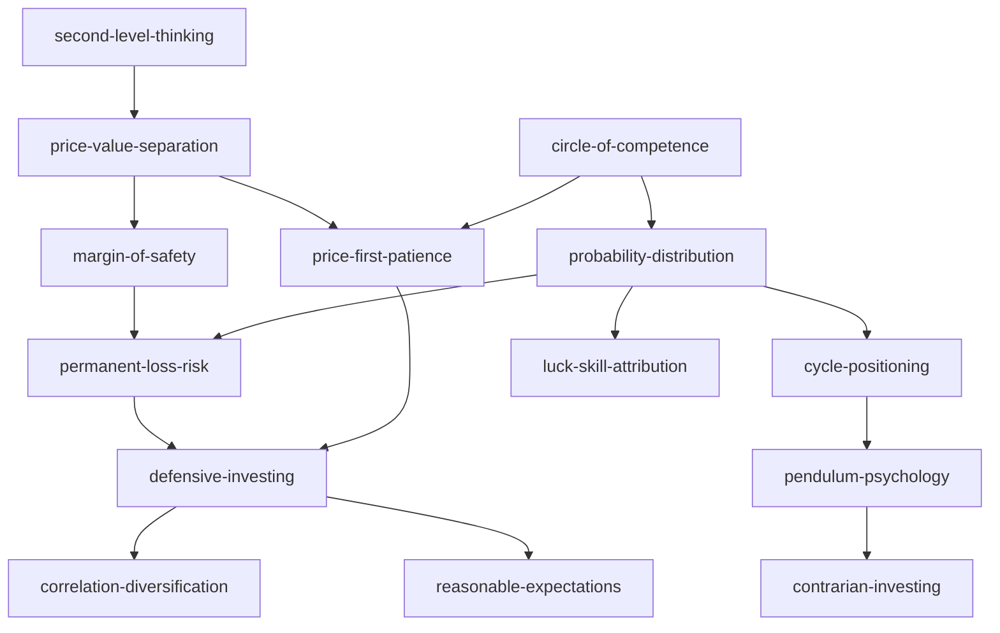

# 《投資最重要的事》Skill Index

> 霍华·马克斯的投资方法论，Stage 2 共生成 14 个独立 skills。

- **作者**: 霍华·马克斯 (Howard Marks)
- **来源**: *The Most Important Thing Illuminated*
- **主旨**: 以第二层思考、价值与价格、风险控制和周期心理，在不确定市场中争取可持续的非对称结果。
- **整书理解**: [BOOK_OVERVIEW.md](./BOOK_OVERVIEW.md)
- **共享术语**: [GLOSSARY.md](./GLOSSARY.md)
- **验证记录**: [verified.md](./verified.md)

## Skill 列表

### 判断与估值

- [`second-level-thinking`](./second-level-thinking/SKILL.md) — 识别共识、价格已反映内容和预期差。
- [`price-value-separation`](./price-value-separation/SKILL.md) — 分开判断价值、价格和心理供需。
- [`margin-of-safety`](./margin-of-safety/SKILL.md) — 把估值误差转为折价和结构缓冲。
- [`probability-distribution`](./probability-distribution/SKILL.md) — 用多情境和概率范围替代单一路径。

### 风险与组合

- [`permanent-loss-risk`](./permanent-loss-risk/SKILL.md) — 识别永久损失、杠杆和被迫卖出。
- [`defensive-investing`](./defensive-investing/SKILL.md) — 以生存和避免大错为优先。
- [`correlation-diversification`](./correlation-diversification/SKILL.md) — 按共同暴露和压力期反应判断分散。
- [`reasonable-expectations`](./reasonable-expectations/SKILL.md) — 用够用回报校准风险预算。

### 周期与心理

- [`cycle-positioning`](./cycle-positioning/SKILL.md) — 判断所处周期位置而非预测拐点。
- [`pendulum-psychology`](./pendulum-psychology/SKILL.md) — 识别群体情绪的极端摆动。
- [`contrarian-investing`](./contrarian-investing/SKILL.md) — 在恐慌或厌恶中寻找有价值支撑的反向机会。
- [`price-first-patience`](./price-first-patience/SKILL.md) — 以价格行动并接受无法精确抄底。

### 认知与复盘

- [`circle-of-competence`](./circle-of-competence/SKILL.md) — 缩小研究范围，承认预测局限。
- [`luck-skill-attribution`](./luck-skill-attribution/SKILL.md) — 区分运气、技巧和跨环境增值。

## 关系图

## 推荐顺序

1. `second-level-thinking`
2. `price-value-separation`
3. `permanent-loss-risk`
4. `margin-of-safety`
5. `probability-distribution`
6. `cycle-positioning` → `pendulum-psychology` → `contrarian-investing`
7. `price-first-patience` → `defensive-investing` → `correlation-diversification`
8. `circle-of-competence` → `reasonable-expectations` → `luck-skill-attribution`

## 审计目录

- 原始候选：[candidates/](./candidates/)
- 合并与淘汰记录：[rejected/](./rejected/)
